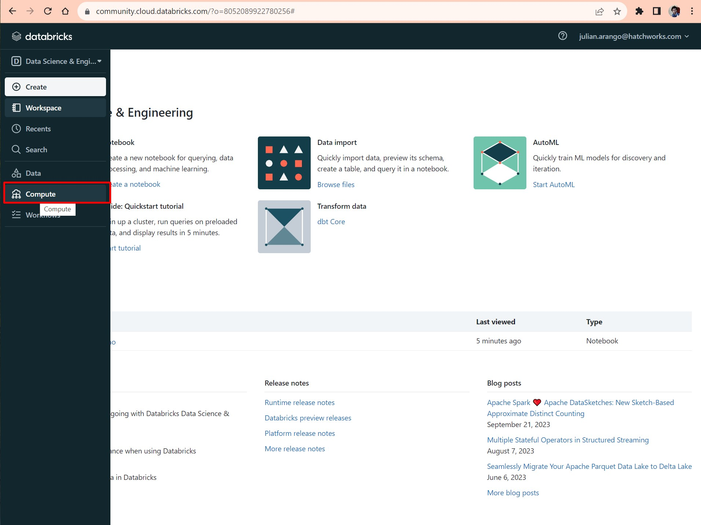
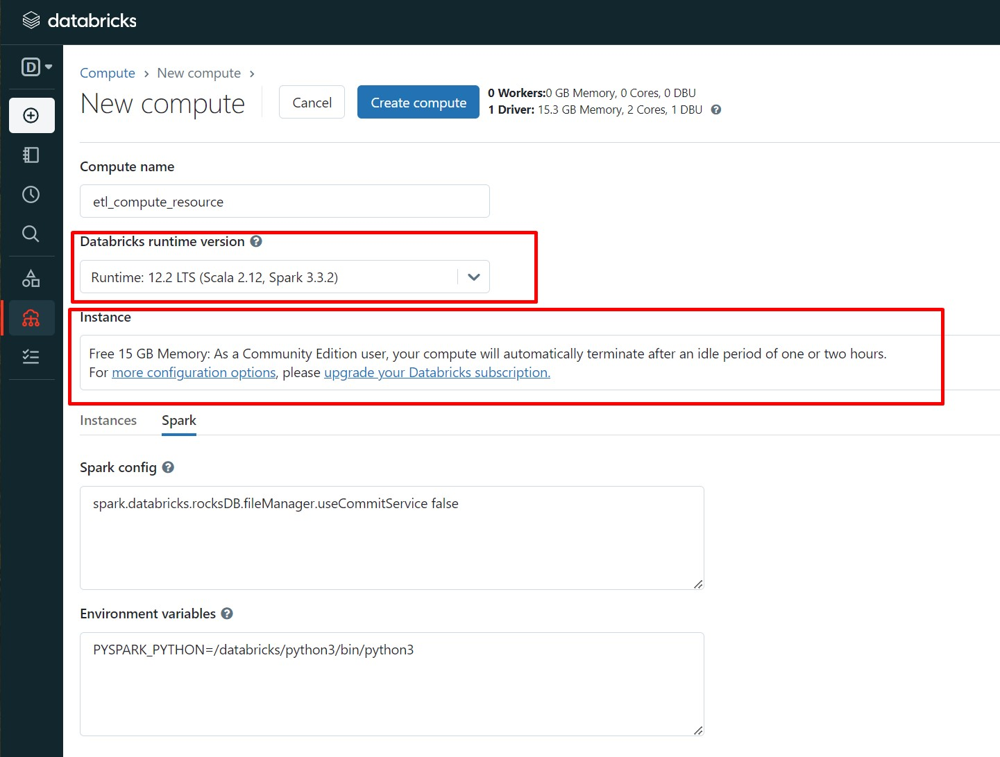
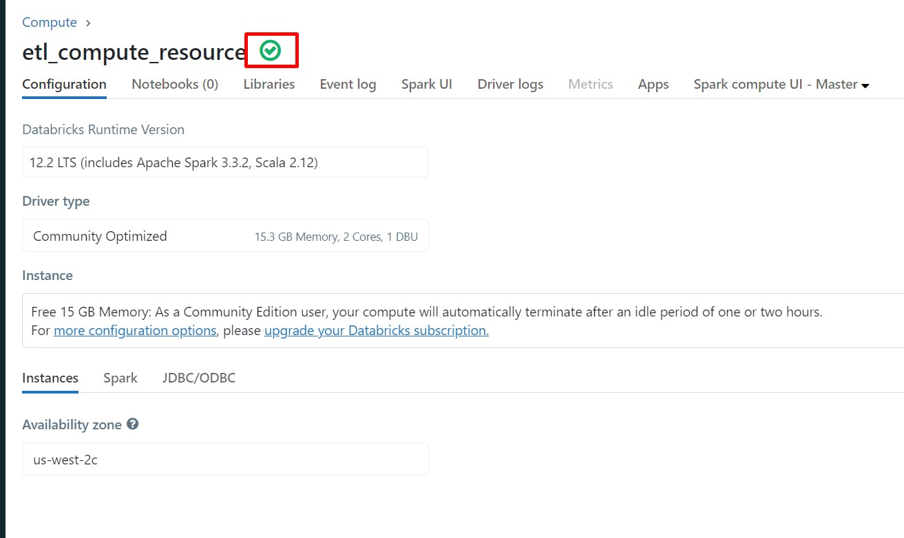
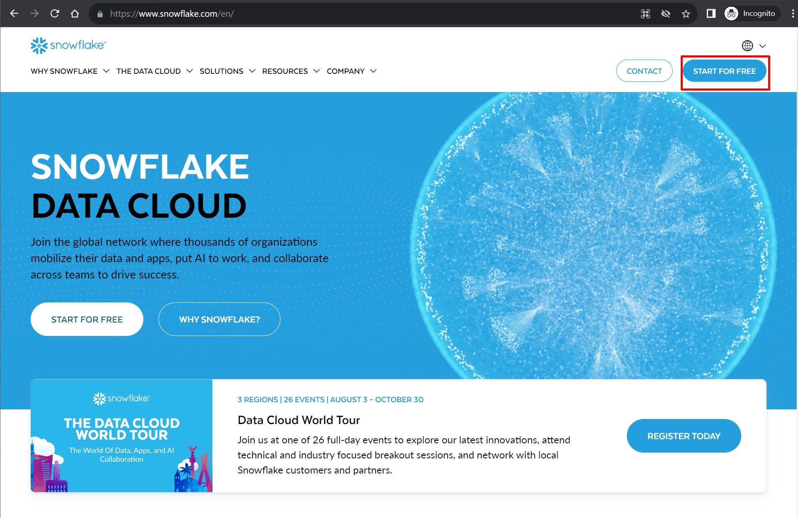
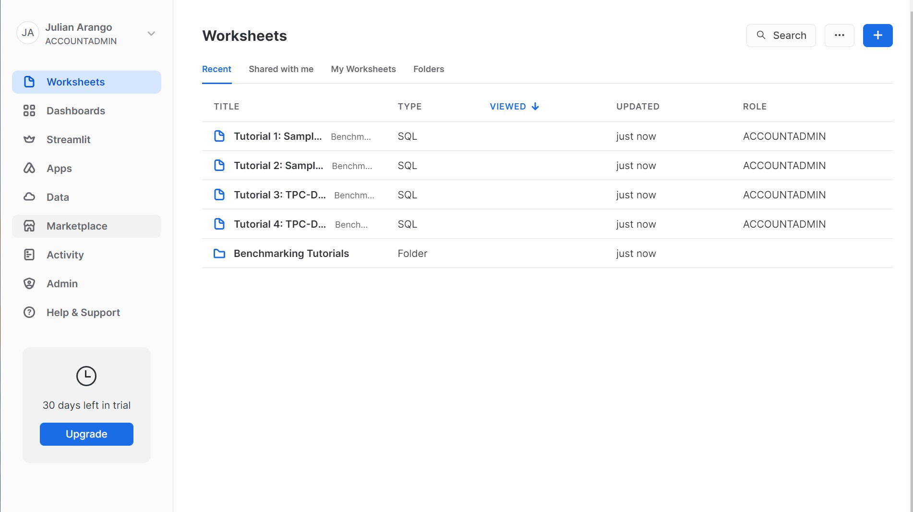
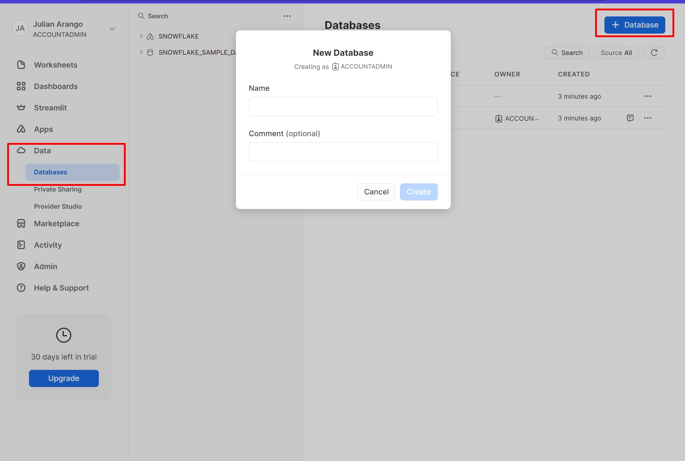
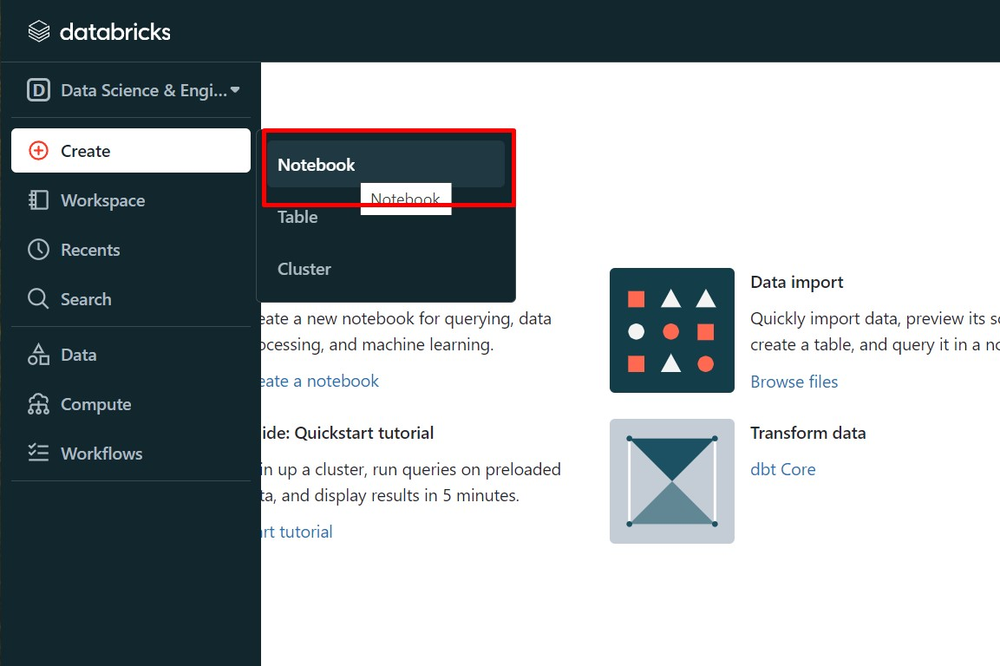
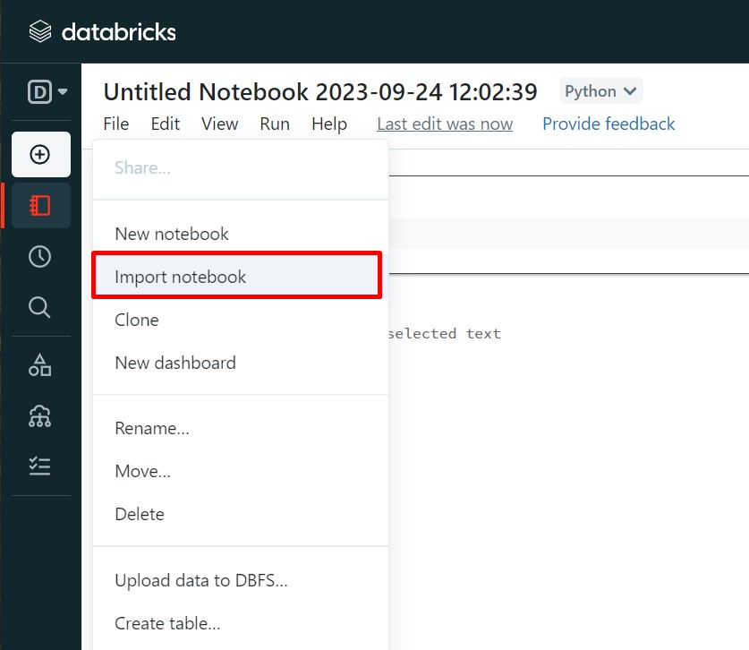
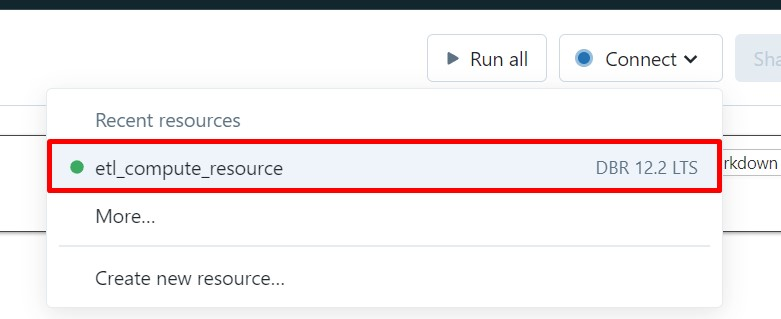

# Data Pipelines with spark and Databricks
An Introduction to the Data Engineering role 

## Environment configuration

First of all we need an environment to run our code, we will create a free Databricks community account [Link to community site](https://docs.databricks.com/en/getting-started/community-edition.html), then verify your address and access to the console

Create a new Compute Resource
Go into the compute section of the left pannel and create a simple compute resource within the default parameters 

Select the 12.2LTS Databricks Runtime

Wait until the cluster creation completes

At the end we will have our cluster ready to code

In the meantime, What If we create our data warehouse?
We will store the data generated by our ETL on Snowflake, Which is a popular Data Lake cloud solution
First, lets go into their main page [Snowflake](https://www.snowflake.com/en/)

Create a trial account, you will have 30 days to play with the platform

You should find yourself in the mainpage, there are several tools and learning resources in here, but we will explore in deep later

Lets create a database, by default It will include a default schema, which will be empty

Lets jump back to Databricks
Now there we are, lets create a new Jupyter notebook the Jupyter Notebook

Import the **Spark ETL Demo.ipynb** Jupyter notebook from the Notebooks folder

Connect the notebook to the compute resource you just create

And we are ready to go!

